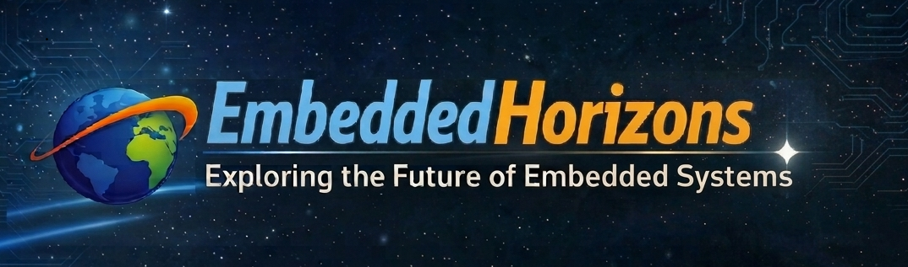
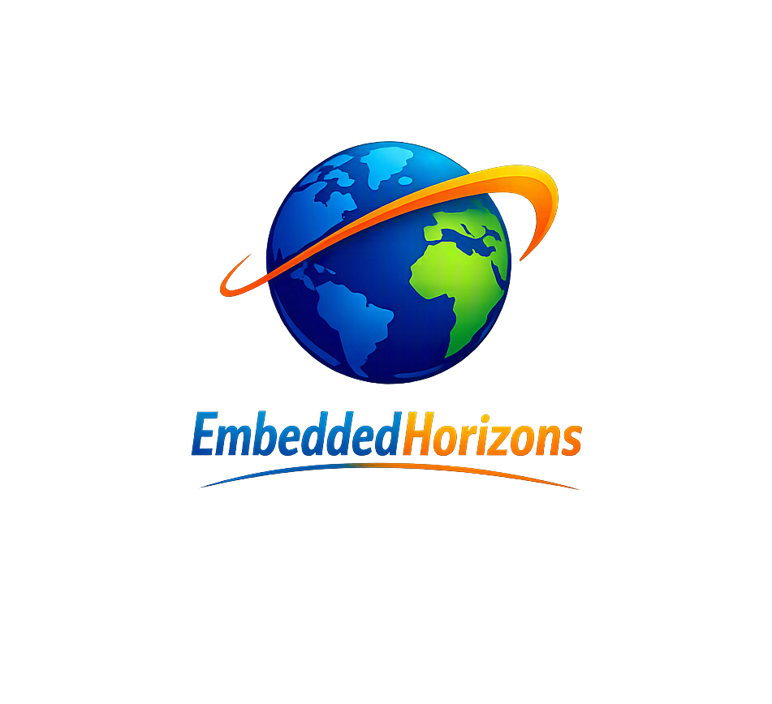

<p align="center">
  
</p>

<p align="center">
  
</p>

<h1 align="center">EmbeddedHorizons</h1>

<p align="center"><i>Exploring the Future of Embedded Systems</i></p>

---

## I. Introduction

**EmbeddedHorizons** is where innovation drives the future of embedded systems.
We deliver knowledge, tutorials, and insights on IoT, Automotive technologies, embedded security, electronics, and firmware development — empowering engineers and enthusiasts to design smarter, safer, and more connected devices.
Our vision is to build a global community that explores the horizons of embedded technology, fosters collaboration, and advances secure innovation.
Join us to learn, create, and push boundaries together.

**Keywords**: Linux, Zephyr, FreeRTOS, ThreadX, SAFERTOS, QNX, VxWorks, Automotive embedded systems, Cybersecurity, embedded firmware, MCU, SoC, engineering tutorials.

### Goals

- **Our mission**: is to contribute open‑source projects and knowledge to the embedded community, with a focus on Embedded Systems, Automotive, and Security. We believe in collaboration, transparency, and building solutions that empower engineers worldwide.

- **Keep it reproducible**: every project lists the board, SDK version and
  tools it was built with, so you get the same result on your bench.
- **Open source**: all code is free to use, study and share under the
  [BSD-3-Clause license](lic/LICENSE.md).

### Repository layout

```text
EmbeddedHorizons/
├── doc/
│   └── resource/        # Logo, banner and images used in the docs
├── lic/
│   └── LICENSE.md       # BSD-3-Clause license and third-party notices
├── <board>/             # One folder per board (e.g. LPC55S69, LPC55S16, Tricore, TI AM62P, ...)
│   └── <project>/       # One project per example
└── README.md
```

Board and project folders are Git submodules, so you can fetch everything at
once or only the parts you need.

---

## II. How to fetch the source

### Prerequisites

- [Git](https://git-scm.com/downloads) 2.13 or newer

### Clone everything (recommended)

```bash
git clone --recursive https://github.com/EmbeddedHorizons/EmbeddedHorizons.git
cd EmbeddedHorizons
```

### Already cloned without `--recursive`?

```bash
git submodule update --init --recursive
```

### Get the latest updates

```bash
git pull
git submodule update --init --recursive
```

### Fetch only one board

```bash
git clone https://github.com/EmbeddedHorizons/EmbeddedHorizons.git
cd EmbeddedHorizons
git submodule update --init --recursive <board>
```

---

## III. How to use

TBD

---

## License

This repository is released under the [BSD-3-Clause license](lic/LICENSE.md).
Parts derived from the MCU SDK keep their original copyright and
license notices. See [lic/LICENSE.md](lic/LICENSE.md) for third-party details.
